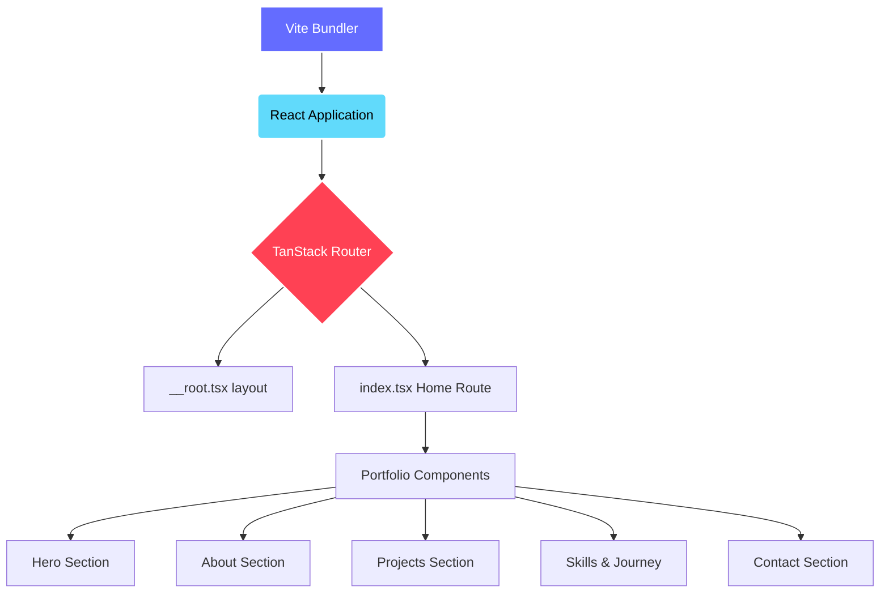

# Abiroy Karmakar — Personal Portfolio

A modern, responsive, and beautifully designed personal portfolio website for Abiroy Karmakar, an aspiring software engineer. This project showcases projects, skills, achievements, and professional journey, built with high-performance web technologies.

## ✨ Features
- **Responsive Design**: Fully responsive layout tailored for mobile, tablet, and desktop viewing.
- **Dynamic Routing**: Single Page Application (SPA) feel with fast route transitions.
- **Interactive UI**: Smooth animations and interactive components.
- **Dark/Light Mode**: Built-in support for theme toggling.
- **Configurable Data**: Easily update portfolio contents (skills, projects, etc.) via a centralized data configuration file.

## 🛠 Tech Stack
- **Frontend Framework**: React 19
- **Build Tool**: Vite
- **Routing**: TanStack Router
- **Styling**: Tailwind CSS v4
- **Language**: TypeScript
- **UI Components**: shadcn/ui (Radix UI + Tailwind)
- **Animation**: Framer Motion
- **Icons**: Lucide React

## 🏗 Architecture Diagram


## 📁 Folder Structure
```text
Portfolio_Abiroy21/
├── index.html           # Main HTML entry point
├── package.json         # Project dependencies and scripts
├── vite.config.ts       # Vite bundler configuration
├── src/                 # Application Source Code
│   ├── main.tsx         # React application entry point
│   ├── router.tsx       # TanStack Router initialization
│   ├── routeTree.gen.ts # Auto-generated route tree
│   ├── styles.css       # Global Tailwind CSS entry
│   ├── assets/          # Static assets (images, icons)
│   ├── components/      # React Components
│   │   ├── portfolio/   # Page-specific portfolio sections
│   │   │   └── data.ts  # Centralized portfolio data
│   │   └── ui/          # Reusable UI components (shadcn/ui)
│   ├── hooks/           # Custom React hooks
│   ├── lib/             # Utility functions
│   └── routes/          # TanStack Router page routes
└── dist/                # Production build output (generated after build)
```

## 🚀 Getting Started

### Prerequisites
- [Node.js](https://nodejs.org/) (v18 or higher recommended)
- `npm` (Node Package Manager)

### Installation

1. **Clone the repository:**
   ```bash
   git clone https://github.com/abhranilsingharoy-cloud/Portfolio_Abiroy21.git
   cd Portfolio_Abiroy21
   ```

2. **Install Dependencies:**
   ```bash
   npm install
   ```

### Running Locally

To start the development server:
```bash
npm run dev
```
*The server will start, typically at `http://localhost:5173` or `http://localhost:8080`. Open this URL in your browser to view the site.*

### Building for Production
```bash
npm run build
```
To preview the production build locally:
```bash
npm run preview
```

## ✏️ Customization
All personal data (Name, Role, Projects, Skills, Contact Info, etc.) is centralized in `src/components/portfolio/data.ts`. You can easily update this file to reflect your own portfolio details without having to dig into component logic.

## 📬 Contact
- **Email**: karmakarabiroy@gmail.com
- **LinkedIn**: [Abiroy Karmakar](https://www.linkedin.com/in/abiroy-karmakar-1ab101338)
- **GitHub**: [AbiroyKarmakar21](https://github.com/AbiroyKarmakar21)
