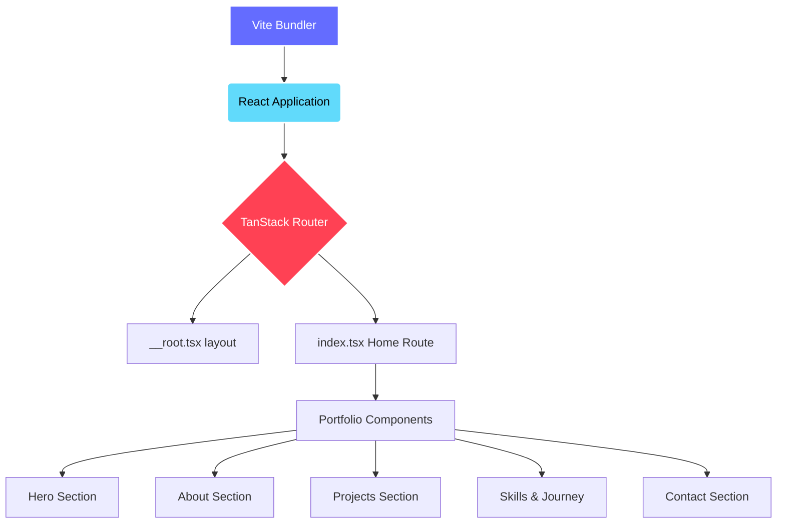

# Abiroy Karmakar — Portfolio

## Description
A modern, responsive, and beautifully designed personal portfolio website for Abiroy Karmakar, an aspiring software engineer. This project showcases projects, skills, achievements, and professional journey, built with high-performance web technologies.

## Tech Stack
- **Frontend Framework**: React 19
- **Build Tool**: Vite
- **Routing**: TanStack Router
- **Styling**: Tailwind CSS v4
- **Language**: TypeScript
- **UI Components**: shadcn/ui (Radix UI + Tailwind)
- **Animation**: Framer Motion
- **Icons**: Lucide React

## Architecture Diagram


## Folder Structure
```text
karmakar_abiroy-portfolio/
├── index.html           # Main HTML entry point
├── package.json         # Project dependencies and scripts
├── vite.config.ts       # Vite bundler configuration
├── src/                 # Application Source Code
│   ├── main.tsx         # React application entry point
│   ├── router.tsx       # TanStack Router initialization
│   ├── routeTree.gen.ts # Auto-generated route tree
│   ├── styles.css       # Global Tailwind CSS entry
│   ├── assets/          # Static assets (images, icons)
│   ├── components/      # React Components
│   │   ├── portfolio/   # Page-specific portfolio sections (Hero, About, etc.)
│   │   └── ui/          # Reusable UI components (shadcn/ui)
│   ├── hooks/           # Custom React hooks
│   ├── lib/             # Utility functions
│   └── routes/          # TanStack Router page routes
└── dist/                # Production build output (generated after build)
```

## How to Run It

### Prerequisites
- [Node.js](https://nodejs.org/) (v18 or higher recommended)
- `npm` (Node Package Manager)

### From the Command Line / Terminal
1. **Install Dependencies:**
   ```bash
   npm install
   ```
2. **Start the Development Server:**
   ```bash
   npm run dev
   ```
   *The server will start, typically at `http://localhost:8080`. Open this URL in your browser to view the site.*
3. **Build for Production:**
   ```bash
   npm run build
   ```
4. **Preview Production Build:**
   ```bash
   npm run preview
   ```

### From Visual Studio Code (VS Code)
1. **Open the Project:**
   Launch VS Code and open the `karmakar_abiroy-portfolio` folder.
2. **Open the Integrated Terminal:**
   Go to the top menu and select **Terminal > New Terminal**, or use the shortcut `` Ctrl + ` `` (backtick).
3. **Install Dependencies (First time only):**
   In the terminal, type `npm install` and press Enter.
4. **Run the Project:**
   In the terminal, type `npm run dev` and press Enter. 
5. **View the Site:**
   VS Code will display a local URL (e.g., `http://localhost:8080`). You can `Ctrl + Click` (or `Cmd + Click` on Mac) the link right in the terminal to automatically open the website in your default browser.
6. **Stop the Server:**
   Click inside the terminal and press `Ctrl + C`, then type `Y` and hit Enter if prompted to terminate the batch job.